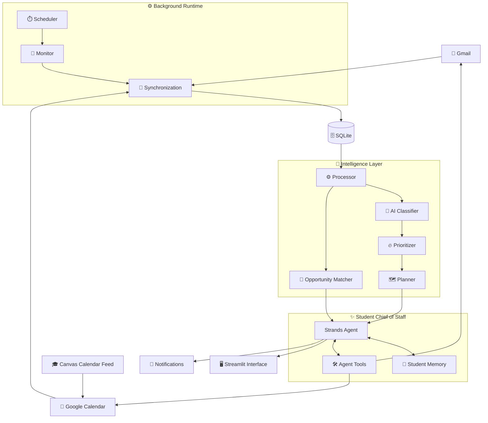

<div align="center">

# 🎓 Student Chief of Staff


<br/>

**An autonomous AI agent that helps college students stay ahead of their digital lives.**

Built with the **Strands Agents SDK**, AWS Bedrock, Gmail, Google Calendar, Canvas Calendar, SQLite, and Streamlit.

<br/>


</div>

---

## ✨ What if your college life could organize itself?

Students constantly jump between:

📧 emails  
📅 calendars  
📚 Canvas deadlines  
💼 opportunities  
📝 assignments  
🤝 meetings  
⏰ reminders  

Important information is scattered across systems, while students are expected to somehow keep all of it synchronized in their heads.

**Student Chief of Staff turns that fragmented information into one intelligent workflow.**

Instead of being another calendar or task manager, it acts as an AI chief of staff that can:

- 📥 monitor incoming email
- 🗓️ understand your schedule
- 🎓 ingest Canvas deadlines through Google Calendar
- 🧠 classify and prioritize information
- ⚡ recognize things that require action
- 🔍 surface opportunities matching your interests
- ✍️ draft email responses
- ⏱️ find free time automatically
- 📆 create, update, reschedule, and delete calendar events
- 🚨 notify you when something actually deserves attention
- 💬 let you manage everything conversationally

---

## 🎬 Example

Instead of manually checking several systems:

> **You:** What do I have tomorrow?

The agent checks its synchronized calendar and gives you a useful summary.

Then:

> **You:** Block 3–4 PM for me to work on my economics homework.

The Chief of Staff can:

```text
Understand the request
        ↓
Resolve "tomorrow"
        ↓
Inspect the day's schedule
        ↓
Check for conflicts
        ↓
Create a work session
        ↓
Write it to Google Calendar
        ↓
Store the event locally
```

Your Google Calendar is updated automatically.

---

## 🧠 How It Works



---

## 🚀 Features

<table>
<tr>
<td width="50%" valign="top">

### 📧 Intelligent Email

The agent synchronizes Gmail into local storage and analyzes new messages.

It can determine:

- category
- importance
- whether action is required
- deadlines
- recommended next action

Noise can stay quiet while important academic and administrative messages rise to the top.

</td>
<td width="50%" valign="top">

### 📅 Calendar Intelligence

The Chief of Staff understands both timed events and all-day deadlines.

It can:

- inspect schedules
- find free time
- detect conflicts
- create events
- update events
- reschedule events
- delete events

Writes are synchronized with the user's primary Google Calendar.

</td>
</tr>

<tr>
<td width="50%" valign="top">

### 🎓 Canvas Awareness

Canvas calendar data is subscribed to through Google Calendar.

This allows the system to understand:

- assignments
- deadlines
- quizzes
- exams
- course events

without requiring direct Canvas API access.

</td>
<td width="50%" valign="top">

### 🎯 Opportunity Matching

The system maintains a lightweight profile of the student's:

- interests
- skills
- target roles
- preferred locations

Relevant opportunity emails can then be scored and surfaced automatically.

</td>
</tr>

<tr>
<td width="50%" valign="top">

### 🧠 Persistent Memory

The Chief of Staff remembers useful student preferences independently from raw email/calendar data.

This enables increasingly personalized decisions without stuffing every interaction into the model context.

</td>
<td width="50%" valign="top">

### 🔄 Background Monitoring

The application doesn't only work when the student sends a message.

A background runtime periodically:

- synchronizes external services
- processes new information
- refreshes priorities
- updates runtime state
- generates relevant notifications

</td>
</tr>
</table>

---

## 🤖 Agent Architecture

The project separates **reasoning**, **deterministic logic**, and **external actions**.

```text
                  ┌──────────────────────┐
                  │   Student Request    │
                  └──────────┬───────────┘
                             │
                             ▼
                  ┌──────────────────────┐
                  │    Strands Agent     │
                  └──────────┬───────────┘
                             │
              ┌──────────────┼──────────────┐
              ▼              ▼              ▼
         Calendar Tools   Email Tools     Memory
              │              │              │
              └──────────────┼──────────────┘
                             ▼
                    ┌─────────────────┐
                    │     SQLite      │
                    └─────────────────┘

                             ▲
                             │
                 Background Processing
                             │
        ┌────────────────────┼────────────────────┐
        ▼                    ▼                    ▼
   Classifier           Prioritizer           Planner
        │                                         │
        └───────────────► Notifications ◄─────────┘
```

The LLM handles semantic understanding while deterministic code handles operations where predictable behavior matters, such as scheduling conflicts, deadline-based priority escalation, database state, and notification deduplication.

---

## 🖥️ Interface

The Streamlit application provides five main views.

### 💬 Chat

Talk directly to the Student Chief of Staff using natural language.

### 📊 Dashboard

See upcoming commitments and the current state of the system.

### 📅 Calendar

Inspect synchronized calendar events with timed and all-day events separated.

### 🎯 Preferences

View the student profile used for opportunity matching.

### ⚙️ System

Inspect scheduler, synchronization, and runtime state.

---

## 🧩 Project Structure

```text
Agents_for_Humans/
│
├── streamlit_app.py
├── requirements.txt
├── README.md
│
├── src/
│   ├── main.py
│   │
│   ├── agent/
│   │   ├── chief_of_staff.py
│   │   ├── prompts.py
│   │   └── tools.py
│   │
│   ├── integrations/
│   │   ├── calendar.py
│   │   ├── emails.py
│   │   ├── google_auth.py
│   │   └── google_calendar.py
│   │
│   ├── processing/
│   │   ├── classifier.py
│   │   ├── opportunity_matcher.py
│   │   ├── planner.py
│   │   ├── prioritizer.py
│   │   └── processor.py
│   │
│   ├── notifications/
│   │   └── notifier.py
│   │
│   ├── runtime/
│   │   ├── monitor.py
│   │   ├── orchestrator.py
│   │   └── scheduler.py
│   │
│   └── storage/
│       ├── database.py
│       ├── memory.py
│       └── state.py
│
└── tests/
```

---

## 🛠️ Tech Stack

| Technology | Purpose |
|---|---|
| **Strands Agents SDK** | Agent reasoning, tool calling, and orchestration |
| **AWS Bedrock** | Foundation-model inference |
| **Python** | Core application |
| **Gmail API** | Email synchronization and draft creation |
| **Google Calendar API** | Calendar synchronization and actions |
| **Canvas Calendar Feed** | Academic deadlines and course events |
| **SQLite** | Persistent local data, memory, analysis, and state |
| **Streamlit** | Interactive web interface |
| **Pytest** | Automated testing |

---

## ⚙️ Installation

### 1. Clone the repository

```bash
git clone <YOUR-REPOSITORY-URL>
cd Agents_for_Humans
```

### 2. Create a virtual environment

```bash
python3 -m venv .venv
source .venv/bin/activate
```

### 3. Install dependencies

```bash
pip install -r requirements.txt
```

### 4. Configure environment variables

Create a `.env` file in the project root.

```env
CALENDAR_BACKEND=google
```

Add any additional AWS/model configuration required by your environment.

> [!IMPORTANT]
> Never commit `.env`, `credentials.json`, `token.json`, or other authentication credentials.

### 5. Configure Google OAuth

Place your Google OAuth client configuration in:

```text
credentials.json
```

The first authenticated run will create the local OAuth token required for Gmail and Google Calendar access.

### 6. Run the application

```bash
streamlit run streamlit_app.py
```

Streamlit will provide a local URL, typically:

```text
http://localhost:8501
```

---

## 🔄 What Happens at Startup?

```text
┌─────────────────────────────────┐
│          Start App              │
└───────────────┬─────────────────┘
                ▼
┌─────────────────────────────────┐
│     Initialize SQLite DB        │
└───────────────┬─────────────────┘
                ▼
┌─────────────────────────────────┐
│        Synchronize Gmail        │
└───────────────┬─────────────────┘
                ▼
┌─────────────────────────────────┐
│ Synchronize Google + Canvas Cal │
└───────────────┬─────────────────┘
                ▼
┌─────────────────────────────────┐
│       Process New Items         │
└───────────────┬─────────────────┘
                ▼
┌─────────────────────────────────┐
│    Refresh Dynamic Priority     │
└───────────────┬─────────────────┘
                ▼
┌─────────────────────────────────┐
│ Start Background Monitoring     │
└───────────────┬─────────────────┘
                ▼
┌─────────────────────────────────┐
│       Chief of Staff Ready      │
└─────────────────────────────────┘
```

> [!NOTE]
> The first run can take longer because synchronized emails and calendar events have not yet been analyzed. Subsequent runs reuse persistent processing state and only process new items.

---

## 🧠 Intelligence Pipeline

### Email

```text
Gmail
  ↓
Synchronize
  ↓
SQLite
  ↓
AI Classification
  ↓
Deadline-aware Priority
  ↓
Opportunity Matching
  ↓
Action Planning
  ↓
Notification / Draft / Ignore
```

### Calendar

```text
Google Calendar + Canvas
           ↓
       Synchronize
           ↓
         SQLite
           ↓
     AI Classification
           ↓
  Deadline-aware Priority
           ↓
      Action Planning
           ↓
       Notification
```

---

## 🔐 Privacy & Safety by Design

The system separates external data from agent reasoning.

- Email and calendar data are synchronized into local SQLite storage.
- Agent-facing read tools primarily operate against local synchronized data.
- Calendar writes are explicitly routed through the Google Calendar integration.
- Canvas calendar subscriptions are treated as read-only.
- Notification history prevents repeated identical alerts.
- Sensitive credentials remain outside source control.

---

## 🧪 Testing

Run the automated test suite with:

```bash
python -m pytest -q
```

The project includes tests for calendar operations, email processing, storage, scheduling behavior, all-day events, and other core functionality.

---

## ♻️ Starting Fresh

For development or demonstrations, you can rebuild the Chief of Staff's local state from scratch.

Stop the application, then move the existing database:

```bash
mv student_chief_of_staff.db student_chief_of_staff_backup.db
```

Restart:

```bash
streamlit run streamlit_app.py
```

A new database will be created and Gmail/Google Calendar data will be synchronized again.

> [!WARNING]
> Resetting the SQLite database does **not** delete Gmail messages or Google Calendar events. Those services remain the external sources of truth.

---

## 💡 Design Philosophy

> **AI should reduce the amount of administration required to be a student — not create another system the student has to manage.**

Student Chief of Staff is designed around three principles:

**1. Background first**  
Useful work should happen even when the student isn't actively chatting with the agent.

**2. Deterministic where it matters**  
LLMs understand intent. Code handles things like conflict detection, persistence, deduplication, and time calculations.

**3. One conversational control layer**  
Students shouldn't need to remember which app contains which piece of information.

---

## 🔭 Future Work

- 🧠 Learn how long individual students typically take to complete assignments
- 📊 Incorporate course workload into scheduling decisions
- 🔁 Re-score historical opportunities when student interests change
- 📱 Push/mobile notifications
- 📬 Richer email action workflows
- 🗓️ Smarter multi-day study planning
- 🔎 More university information sources
- ☁️ Deploy the background runtime for persistent operation

---

## 🏆 Built for Agents for Humans

Student Chief of Staff was created for the **Agents for Humans Hackathon** using the **Strands Agents SDK**.

The project explores a simple question:

> ### What if an AI agent didn't just answer questions about your life, but quietly helped you keep it organized?

---

<div align="center">

### 🎓 Student Chief of Staff

**Your inbox has information.  
Your calendar has commitments.  
Your Chief of Staff connects the two.**

<br/>

Made with 🧠 + ☕ + probably too many calendar events.

</div>
